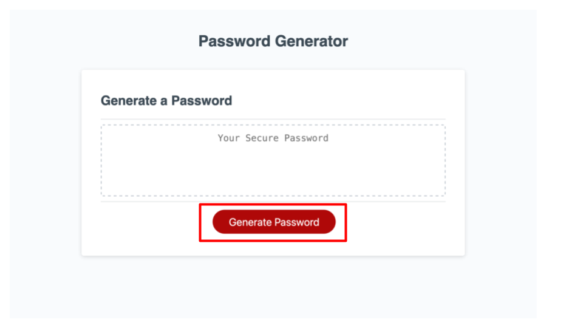
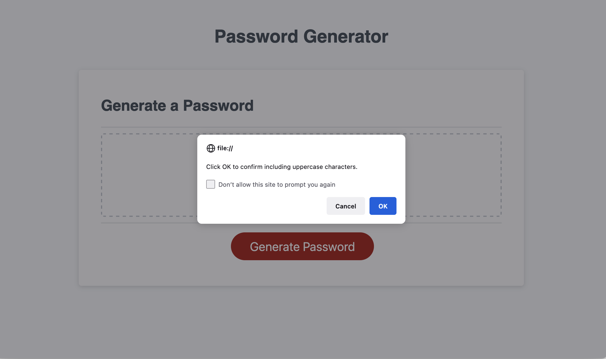
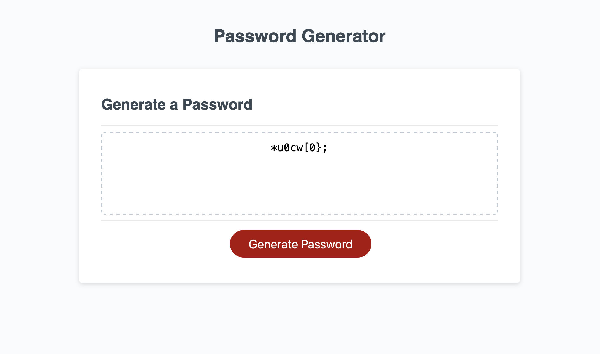

# Password Generator

## Description

The purpose of this project was to create a web application that generates a random password according to a user's preference. This application helps solve issues with user's that need help coming up with new passwords.

In this project I've learned how javascript works together with html and css to create a more interactive user experience. I've learned how to create functions in javascript and how to create conditional statements to return the outcome that I want.

## Installation

1. Move to your desired installation folder/directory using the `cd` command.
2. Use the following command to clone the repository on to your machine:

```
git clone git@github.com:tyang896/password-generator.git
```

## Usage
To view a live demonstration, you can visit the deployed webpage here: https://tyang896.github.io/password-generator/

1. Open the `index.html` file using the desired browser of your choice. The webpage should look like the following:


2. To Generate a password, click on the `Generate Password` button.



3. A prompt will come up asking you how many characters you want for your password. Enter a number between 8 through 128. (Note: The appearance may be different for you depending on your browser)


4. You will get a series of prompts that will ask you what type of characters you want for your password. Click `Cancel` to say no or click `OK` to say yes.



5. After answering all prompts, your password should display inside of the textbox.



## License

MIT License

Copyright (c) [2022] [Talee Yang]

Permission is hereby granted, free of charge, to any person obtaining a copy
of this software and associated documentation files (the "Software"), to deal
in the Software without restriction, including without limitation the rights
to use, copy, modify, merge, publish, distribute, sublicense, and/or sell
copies of the Software, and to permit persons to whom the Software is
furnished to do so, subject to the following conditions:

The above copyright notice and this permission notice shall be included in all
copies or substantial portions of the Software.

THE SOFTWARE IS PROVIDED "AS IS", WITHOUT WARRANTY OF ANY KIND, EXPRESS OR
IMPLIED, INCLUDING BUT NOT LIMITED TO THE WARRANTIES OF MERCHANTABILITY,
FITNESS FOR A PARTICULAR PURPOSE AND NONINFRINGEMENT. IN NO EVENT SHALL THE
AUTHORS OR COPYRIGHT HOLDERS BE LIABLE FOR ANY CLAIM, DAMAGES OR OTHER
LIABILITY, WHETHER IN AN ACTION OF CONTRACT, TORT OR OTHERWISE, ARISING FROM,
OUT OF OR IN CONNECTION WITH THE SOFTWARE OR THE USE OR OTHER DEALINGS IN THE
SOFTWARE.